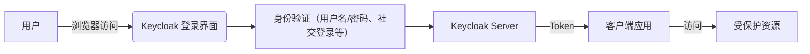

# 🛡️ Keycloak 简介与架构

## 📌 什么是 Keycloak？
Keycloak 是一个开源的身份和访问管理 (IAM) 解决方案，支持单点登录 (SSO)、身份认证、授权和用户管理功能，适用于现代应用程序与服务。

它由 Red Hat 领导维护，广泛用于微服务架构、安全网关、企业级权限控制等场景。

## 🧠 Keycloak 的核心原理
Keycloak 基于 OAuth 2.0、OpenID Connect 和 SAML 2.0 等标准协议构建，允许开发者将认证交给 Keycloak 处理，从而简化应用程序的身份安全实现。

- 🔐 **身份认证**：用户通过 Keycloak 登录，获取访问令牌。
- 🆔 **授权管理**：定义角色（Role）与权限（Permission）来控制资源访问。
- 🔁 **单点登录与登出**：一次登录，访问多个系统；统一登出清除所有登录状态。
- 📦 **多协议支持**：支持标准 OAuth2、OIDC、SAML 协议，兼容性强。

## 🏗️ Keycloak 架构图



或简化为：

```
[用户] --浏览器--> [Keycloak Server] --Token--> [客户端] --请求--> [受保护服务]
```

## ⚙️ Keycloak 的组件

- 🏛️ **Realm**：一个逻辑隔离的空间，定义了一组用户、角色和客户端。
- 👥 **User**：系统中的用户，可以直接创建或集成 LDAP、AD。
- 🎭 **Client**：接入 Keycloak 的应用，支持配置访问类型与协议。
- 🧩 **Role / Group**：用于权限控制和组织管理。
- 🔌 **Identity Provider (IdP)**：第三方身份源（如 Google、GitHub 等）。

## 🎯 Keycloak 的作用

1. ✅ 实现统一认证与授权：简化多系统的登录逻辑。
2. 🔄 提供单点登录能力：一次登录，处处通行。
3. 🔐 支持精细化权限控制：通过角色与策略进行访问控制。
4. 🧬 集成多种身份源：支持 LDAP、Active Directory、社交账号。
5. 📊 提供可视化管理界面：方便配置用户、角色、客户端。
6. 📤 支持 REST API 与 Admin CLI：可集成自动化平台。

## 📚 总结
Keycloak 是一款功能强大的 IAM 工具，适用于从小型项目到企业级系统的认证与授权需求。通过标准协议、灵活配置以及丰富的集成能力，为现代应用安全保驾护航。

---

🔗 相关链接：
- 官网：[https://www.keycloak.org](https://www.keycloak.org)
- GitHub：[https://github.com/keycloak/keycloak](https://github.com/keycloak/keycloak)
- 文档：[https://www.keycloak.org/documentation.html](https://www.keycloak.org/documentation.html)
