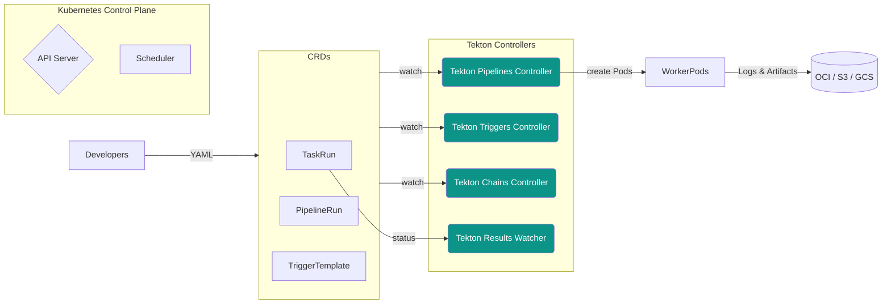

# Tekton 架构详解 🛠️🚀

> **最后更新**：2025-05-09  
> **适用版本**：Tekton Pipelines v0.56+ / Triggers v0.25+ / Chains v0.17+  
> **作者**：ChatGPT  

## 1. 项目简介
Tekton 是 [CD Foundation](https://cd.foundation/) 旗下的 **云原生 CI/CD** 基础框架，运行于 Kubernetes 之上，通过一系列 CRD 为流水线提供原生、可扩展的执行能力。Tekton 生态由 **Pipelines**、**Triggers**、**Chains**、**Results**、**Hub**、**CLI**、**Dashboard**、**Operator** 等模块组成，可组合为完整的软件供应链平台。


---

## 2. 组件总览

| 模块 | 作用 | 关键 CRD | 控制器部署 |
| --- | --- | --- | --- |
| **Pipelines** | 定义 / 执行 CI/CD 任务与流水线 | `Task`, `TaskRun`, `Pipeline`, `PipelineRun`, `CustomRun` | `tekton-pipelines-controller`, `tekton-pipelines-webhook` |
| **Triggers** | 事件驱动触发流水线 | `TriggerTemplate`, `TriggerBinding`, `EventListener` | `tekton-triggers-controller`, `tekton-triggers-webhook` |
| **Chains** | 生成并签名制品及 SLSA/SBOM 证明 | 无新增 CRD，监听 `TaskRun` / `PipelineRun` | `tekton-chains-controller` |
| **Results** | 存储/查询历史运行记录 | `Result`, `Record` (CRD) | `tekton-results-api`, `tekton-results-watcher` |
| **Hub / Catalog** | 共用 Task / Pipeline 市场 | N/A | Web 服务 (`hub`) |
| **Dashboard** | Web UI | N/A | `tekton-dashboard` |
| **CLI (`tkn`)** | 终端工具 | N/A | 本地二进制 |
| **Operator** | 生命周期管理（安装/升级） | `TektonConfig`, `TektonPipeline`… | `tekton-operator-controller` |

---

## 3. 核心架构分层



- **Declarative CRD Model**：所有流水线元素均为 Kubernetes 资源，控制器通过 informer 监听资源变更并创建 **工作负载 Pod**。  
- **Controller Runtime**：控制器自身作为 Deployment 运行，可设置 **HA** 副本并使用 **leader election**。  
- **Artifact Flow**：步骤在 Pod 内执行，产物通过 **PVC / OCI Registry / ObjectStorage** 存储；Chains 读取 `TaskRun` 结果生成签名与 provenance。  

---

## 4. 执行流程（Pipeline → Task → Step）

1. **提交流水线**：用户创建 `PipelineRun` （或经 Triggers 自动创建）。  
2. **调度 TaskRun**：Pipelines Controller 解析依赖，生成一个或多个 `TaskRun`。  
3. **创建 Pod**：Controller 依据 Task 定义的步骤（Step）与镜像生成 Pod YAML，写入 `tekton.dev/...` 注解。  
4. **执行 Step**：每个 Step 作为 **容器** 顺序 / 并行运行，结果通过 `$(results.*)` 传递。  
5. **状态回写**：Sidecar `entrypoint` 注入，负责报告进度；Pod 完成后 Controller 更新 `TaskRun` / `PipelineRun` Status。  
6. **签名与存证**：Chains 监听完成事件，收集产物摘要并生成 **in‑toto** & **SLSA** 证明，使用 **Sigstore / KMS** 进行签名。

---

## 5. 网络与安全

- **ServiceAccount + RBAC**：默认安装创建 `tekton-pipelines-controller` SA；任务可自定义 SA 以最小权限执行。  
- **Pod Security**：在 OpenShift 等严格环境需给 Controller 适当 `SCC` / PSP。  
- **Supply‑Chain Security**：Chains 支持 **x509 / Cosign / Keyless** 等方案；可集成 **KMS (GCP KMS / AWS KMS)**。  

---

## 6. 高可用与扩展

| 维度 | 方案 |
| --- | --- |
| **Controller HA** | `Deployment` ≥ 2 副本 + `--enable-leader-election` |
| **Scale Out** | 依赖 K8s 调度，节点资源瓶颈时水平扩容工作节点 |
| **Multi‑tenant** | 使用 `namespace`+`RBAC` 隔离；Triggers 可结合 `ClusterInterceptors` 做校验 |
| **Observability** | 控制器导出 Prometheus 指标 (`/metrics`)，支持 OpenTelemetry Collector Sidecar |
| **Resilience** | Results 存储运行历史，支持 gRPC / REST 查询，方便重试与审计。 |

---

## 7. 与其他云原生工具的对比

| Feature | Tekton | Argo Workflows | Jenkins | GitHub Actions |
| --- | --- | --- | --- | --- |
| 核心平台 | Kubernetes CRD | Kubernetes CRD | JVM | SaaS |
| 全云原生 | ✅ | ✅ | ➖ | ✅ |
| 任务可复用 | Tekton Catalog | Argo Templates | Shared Libraries | Marketplace |
| 供应链安全 | Chains (SLSA) | Sigstore add‑on | 外挂插件 | 内置 |
| 宣言式触发 | Triggers | EventSource + Sensor | Webhook plugins | Events |

---

## 8. 典型生产部署示例

```bash
# 安装 Pipelines
kubectl apply -f https://storage.googleapis.com/tekton-releases/pipeline/latest/release.yaml

# 安装 Triggers
kubectl apply -f https://storage.googleapis.com/tekton-releases/triggers/latest/release.yaml

# 安装 Chains (带 Cosign 签名)
kubectl apply -f https://storage.googleapis.com/tekton-releases/chains/latest/release.yaml
kubectl create secret generic signing-secrets   --from-file=cosign.key=cosign.key --from-file=cosign.password=<pwd>   -n tekton-chains
```

> **Tips**  
> - 若需集中管理，各组件可统一部署在 `tekton` 命名空间。  
> - 推荐配合 **Tekton Operator** 简化升级与配置。  

---

## 9. 参考链接

- 官方文档：<https://tekton.dev/docs/>  
- Tekton Community：<https://github.com/tektoncd/community>  
- Chains Supply‑Chain 安全指南：<https://tekton.dev/docs/chains/>  

---

© 2025 Tekton Community & Linux Foundation  
Licensed under the Apache License 2.0
